# Final-PJT

# 🖥️ 코드 실행 방법

```bash
**### Visual Studio Code Bash**

$ cd LAUNDRY-MOVIE

# 가상환경 설정
$ python -m venv venv

$ source venv/Scripts/activate

$ pip install -r requirements.txt

$ python manage.py migrate

$ python manage.py runserver
```

```bash
**### url 창**

# 장르 data 받기
python manage.py loaddata fixtures/genres.json

# 영화 데이터 받기
python manage.py loaddata fixtures/movies.json
```

# 📅 프로젝트 기간

### 💡**아이디어 회의 및 구상**

5월 11일(수) ~ 19일(목)

### 🎨**개발 및 디자인 작업**

5월 20일(금) ~ 26일(목)

---

# 👥 팀원 정보 및 업무 분담 내역

## 👨🏻‍💻 박종민

- Front-End
  - 반응형 웹 구현
  - Django, jquery, javascript, css, bootstrap
  - 홈페이지, footer, navbar 전체 디자인 구상
  - 모든 버튼을 다 구현

## 👨‍💻 임상빈

- Back-End
  - Django
- `Figma`
  - 와이어프레임 스케치
  - 최종 Design
- 스케줄링 자료 정리 및 README 정리
- 포토샵

## 👨🏻‍🎨공통🧑🏻‍💻

- 초기 아이디어 스케치 in `Figma`
- `VS Code live share`를 이용한 동시 작업
- `디스코드`를 이용한 실시간 회의
- `Notion`을 이용한 schedule 관리
- 영화 Data 생성 코드 및 Django를 이용해 Movies app의 (model, views, serializer) 구성

---

## 🧬 데이터베이스 모델링 (ERD)

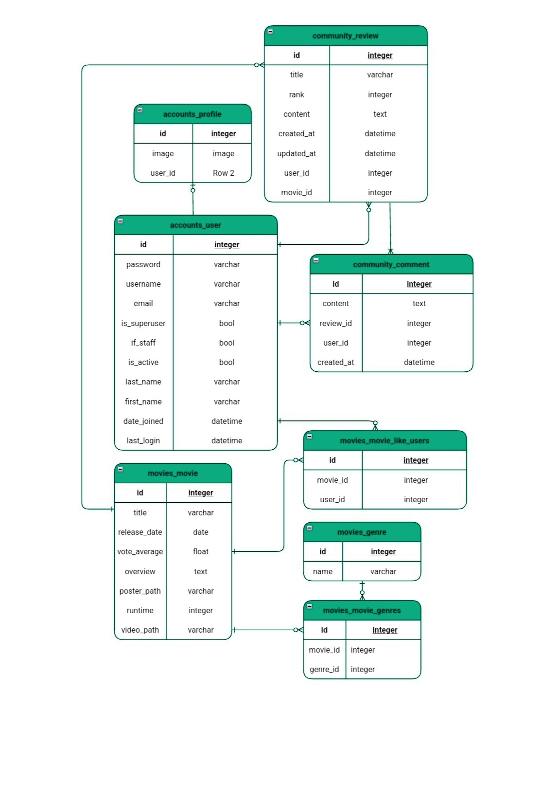

- 영화 데이터 **TMDB** 사용
- 한 영화가 여러 개의 장르를 가짐 & 장르는 여러 개의 영화에 들어감 → **M:N 관계**
- 한 영화를 여러 사용자가 Like & 한 사용자가 여러 영화를 Like → **M:N 관계**
- 한 영화에 여러 개의 리뷰를 달 수 있음 → **1:N 관계**
- 한 사용자가 여러 개의 리뷰를 쓸수 있음 → **1:N 관계**
- 한 사용자가 여러 개의 댓글을 달 수 있음 → **1:N 관계**
- 한 리뷰(게시글)에는 여러 개의 댓글을 달 수 있음 → **1:N 관계**
- 유저 & 프로필 → **1:1 관계** & **[ 유저는 무조건 존재하지만 프로필은 없거나 한 개만 존재 ]**

---

## 🏁목표 서비스 구현 및 실제 구현 정도

### 🤔 기획의도

‘영화를 언제, 어디서, 어떻게 접하는 경우가 많을까?’ 라는 생각에서 시작된 궁금증이 이 프로젝트의 컨셉으로 정해지게 되었습니다.

집 안에서 생활을 많이 하면서 OTT서비스를 많이 이용하게 되었고, 필요할 때 심심할 때마다 시간을 보내기 위해 영화를 보는 경우가 많습니다.

저희는 집 안에서 벌어지는 일들 중에서 어떤 일이 가장 시간을 많이 보내게 될까? 생각을 했고, `빨래`를 생각하게 되었습니다.

빨래를 분류하고, 세탁기에 넣어 돌리고 탈수 시키고 건조하기까지 오랜 시간 걸리기 때문에 이 시간을 영화와 함께 보낸다면 빨래가 끝나기까지 기다리는 시간이 즐겁지 않을까 생각되어 `빨래 + 영화` 의 조합을 생각하게 되었습니다. 

그리하여 빨래를 위해 빨랫감의 색상을 분류하는 것과 세탁 모드에 포커스를 두어 이용자가 세탁을 돌리는 방식에 따라 영화를 추천하는 `런드리무비`를 기획하게 되었습니다.

## 🥅 목표 서비스

빨래를 하는 사람들의 `세탁 방식을 활용해 다양한 장르의 영화를 추천`하여 새로운 분야나 정보를 접할 수 있도록 영화를 추천하고 이를 `다른 사람들과 후기를 공유하고 소통`할 수 있도록 서비스를 제공하고자 하였습니다.

## 🧑🏻‍⚕️구현 서비스 설계🛠️

### ✍🏻 페이지 스케치

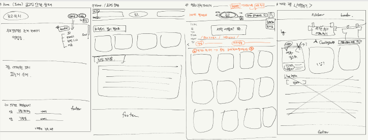

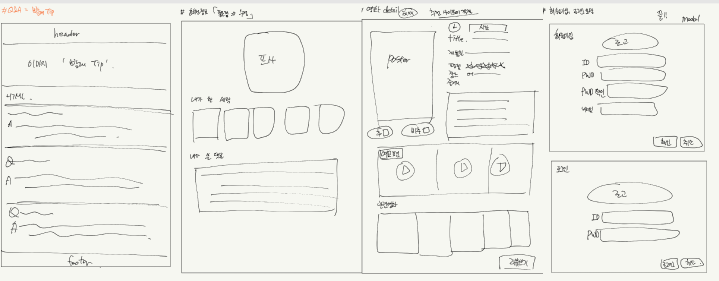

컨셉을 돋보이게 하면서 처음 사용하는 사용자들도 쉽게 이용할 수 있는 홈페이지와 서비스를 위해 간략하게 스케치를 진행하였습니다.

# 👍 빨랫감 분류와 세탁 모드 활용하여 영화 추천 (알고리즘 활용한 추천 서비스 구현)


## 구현 전 페이지


💭 처음 설계를 진행할 당시에는 세탁 모드를 많이 분류하여 세분화시키려고 진행했습니다.

💭 세탁기를 사용하는 사람들을 대상으로 인터뷰를 진행해보니 사용하는 모드가 정말 한정적이라는 것을 알아낼 수 있었고, `표준, 쾌속, 이불 또는 삶음` 모드를 이용하기로 결정하였습니다.

💭 색상과 세탁 모드를 결정하면 로직을 거쳐 영화들이 보여질 수 있도록 하였습니다.

## 구현한 페이지


🔨 배경 사진을 뒤에 넣으려고 했으나 기본적으로 흰 배경이 깔끔하게 보인다 판단되어 삽입하지 않았습니다.

🔨 구현 전 페이지에서는 버튼을 누르면 색상이 채워지는 방향으로 구상을 했으나 radio 버튼을 활용하고, radio 선택 버튼을 초기화할 수 있는 버튼을 하단에 두어 다시 선택할 수 있도록 하였습니다.

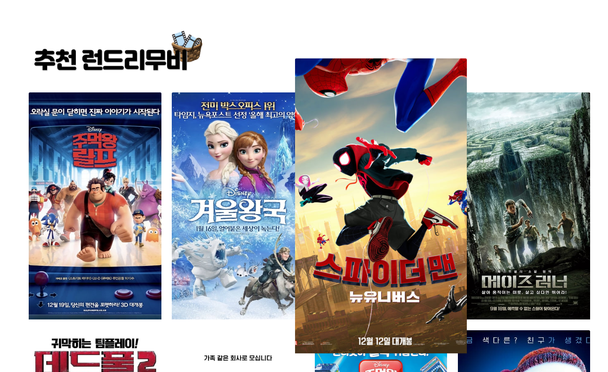

🔨 radio 버튼 클릭 시 이벤트가 발생하도록 하여 다른 submit 과정 없이도 추천 영화 목록이 보여질 수 있도록 axios를 사용하였습니다.

🔨 추천으로 뜬 영화 포스터를 호버링하면 포스터가 커지며 클릭하면 각 영화의 세부 페이지로 이동하도록 구현하였습니다.


---

# 💬 다른 이용자들과 영화 후기 공유 (커뮤니티 서비스 구현)

## 영화 리뷰 게시판

## 구현 전 페이지


💭 후기를 남길 수 있는 페이지를 만들고 그 안에 카드 형태로 제목과 어떠한 영화에 대한 리뷰인지 알 수 있도록 사진이 띄워질 수 있도록 구상하였습니다.

💭 작성자의 프로필 사진도 게시글 썸네일 자체에 띄우고자 생각하였습니다.

💭 페이지네이션을 구현하여 특정 카드 개수가 차면 다음 페이지로 이동하여 볼 수 있도록 구상하였습니다.

💭 디자인 측면에서 상단에는 특정 배너 구간을 만들어서 공간을 차지하고 게시판은 하단의 3분의 2정도를 차지하도록 설계하였습니다.

## 구현한 페이지

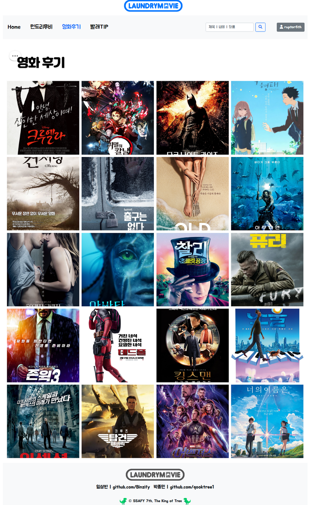

🔨 카드 형태로 어떠한 영화의 리뷰인지 볼 수 있도록 영화의 포스터가 띄워질 수 있도록 하였습니다.

🔨 해당 포스터에 마우스를 호버링하는 경우 리뷰의 제목(한 줄 평)과 작성자, 작성 시간이 띄워지도록 구현하였습니다.


🔨 전체 메뉴의 디자인을 따라하여 배너를 타이포그래피와 이모지만 활용하여 소통하는 느낌을 전달하였습니다.

🔨 기존 ‘세탁 후기’ 로 썼던 메뉴를 직관적으로 ‘영화 후기’로 변경하였습니다.


### 후기 작성 폼


## 구현 전 페이지


💭 리뷰를 쓰고자하는 영화 제목이 게시판에 자동으로 작성되며, 제목과 유저, 내용을 쓰고 작성할 수 있도록 하였습니다.

💭 리뷰에서 추천과 비추천을 표시할 수 있도록 구상하였습니다.


## 구현한 페이지


🔨 리뷰를 쓰고자하는 영화의 제목이 뜨도록 구현하였습니다

🔨 제목이 아닌 한 줄 평으로 해당 영화의 느낌이나 후기를 남길 수 있도록 하였습니다.

🔨 추천/비추천이 아닌 별점으로 영화에 대한 점수를 매길 수 있도록 하였습니다.

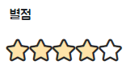

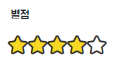

🔨 별점 작성 시 마우스로 호버링 시 연한 노란색이 채워지다 클릭 시 진한 노란색으로 표현됩니다.


### 상세 리뷰 페이지


🔨 한 줄 평, 별점, 내용, 작성 일자가 보여질 수 있도록 하였고, 그 아래로는 작성된 댓글과 댓글을 작성할 수 있는 폼이 있습니다.

🔨 리뷰를 작성한 영화의 포스터가 상단에 보여질 수 있도록 하였고, 해당 위치에 마우스를 갖다대면 영화 상세 페이지로 이동할 수 있도록 구현하였습니다.


### 리뷰 수정과 삭제


🔨 리뷰 수정은 한 줄 평과 후기가 자동으로 완성되도록 하였고, 별점은 다시 매기는 방식으로 구현하였습니다.

🔨 리뷰 삭제 버튼을 누르면 삭제 알림이 뜨며, 확인 버튼을 누르면 삭제가 되도록 하였습니다.

---

# 🧐 런드리무비의 또 다른 포인트

### 📌 인덱스 페이지


로그인을 하지 않은 상태에서 보여지는 런드리무비의 소개 페이지로 스크롤 시 다음 소개 이미지가 등장하며 상단의 로그인과 회원가입 버튼이 따라옵니다.

런드리무비를 이용해보고 싶도록하는 카피와 이미지로 인덱스 페이지를 구상하였습니다.

### 📌 Home 페이지

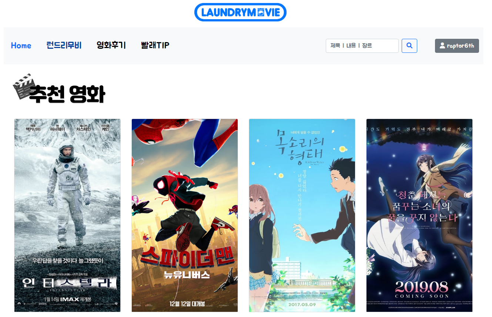


처음 로그인 시 마주하는 페이지입니다. 해당 페이지에서는 추천 알고리즘을 거치지 않은 평점이 높은 영화들을 위주로 Carousel을 이용하여 시간이 지나면 자동으로 다른 목록이 보여지도록 구현하였습니다.


추천 영화 하단에는 방금 올라온 게시글 (후기) 들이 보여지며, 제목과 각 후기에 달린 댓글의 수가 보여집니다.

### 📌 영화 상세 페이지


영화의 상세(디테일) 페이지입니다.

포스터와 기본 정보들이 보여지며, 제목 옆에 있는 최고 마크를 눌러 영화를 추천한다고 표시할 수 있습니다.

리뷰쓰기 버튼이 있어서 상세페이지에서 바로 영화에 대한 후기를 작성할 수 있습니다.


영화에 대한 정보 소개 하단에는 관련 영상이 유튜브로 바로 연결되어 보여지며, 그 아래에는 관련된 영화의 포스터들이 보여집니다.

### 📌 빨래TIP 페이지

런드리무비의 컨셉에 맞게 세탁에 대한 꿀팁을 담은 페이지입니다.

만약 우리가 서비스를 실제로 구현한다면? 이라 상상하여 만든 페이지입니다.

매 주 세탁과 빨래에 대한 팁을 업데이트하는 방식으로 만들었습니다.

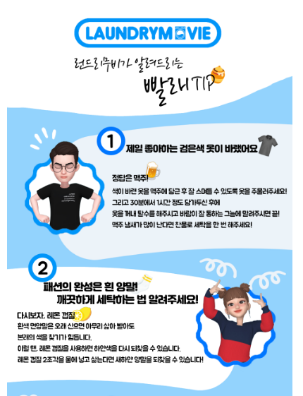

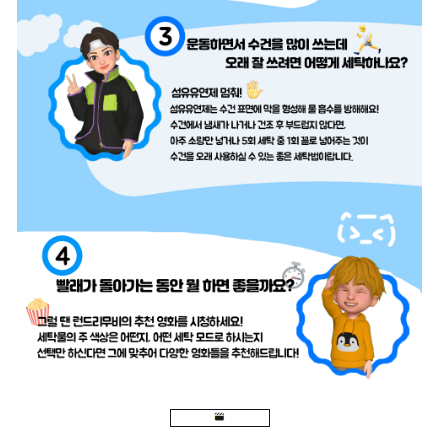

### 📌 Navbar 그리고 footer

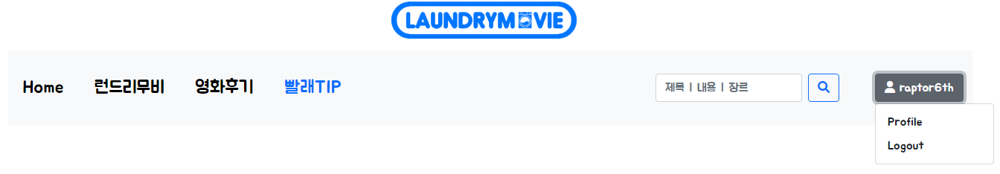

Navbar에는 각 페이지로 이동할 수 있는 메뉴와 검색창, 그리고 로그인 되어있는 유저의 이름이 보여지는 프로필 버튼이 구현되어 있습니다.

검색 창에 원하는 영화나 장르, 내용을 입력하면 해당하는 영화들이 보여집니다. `탐정` 입력 시 아래와 같은 결과가 보여집니다.

 


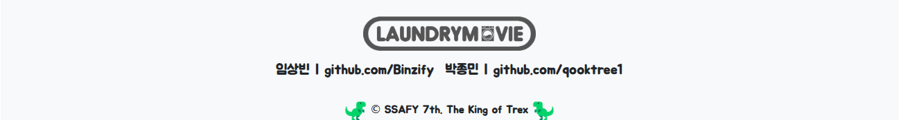

Footer에는 서비스 구현에 참여한 저희의 이름과 깃허브 주소가 포함되어 있으며, 6반의 상징인 티라노를 활용하여 저작권 표시하였습니다.

### 📌 유저 프로필 페이지

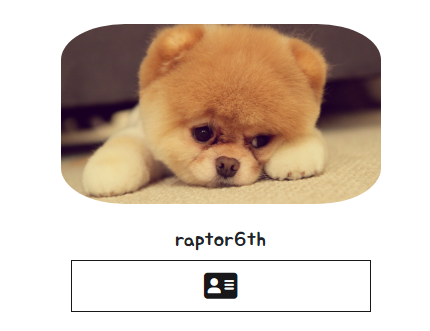

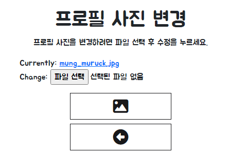

유저 프로필 페이지에는 유저가 직접 프로필 사진을 등록할 수 있도록 하였습니다


또 유저가 작성한 후기와 댓글을 확인할 수 있도록 하였습니다.

---

# 🎙️개발자 인터뷰👨🏻‍💻

## 🗓️ 첫 7일동안의 프로젝트, 어떠셨나요?

### 👨‍💻 임상빈

- 일주일이라는 어찌보면 길기도 하고, 짧기도 한 이 기간동안 프로젝트를 하면서 정말 주제가 주어졌음에도 오랜 기간동안 기획하고, 구상하는 과정을 거쳐 실제로 만들기까지 정말 많은 개발자과 디자이너들의 노력이 있었음을 체험해볼 수 있었습니다. 싸피에는 능력자들이 너무 많다는 것도 절실히 느끼고 갑니다!! 😀

### 👨🏻‍💻 박종민

- 7일 이라는 제한된 시간 동안에 기획부터 구현까지 팀원과 같이 프로젝트에 참여하게 되어 매우 뜻깊은 시간을 보냈습니다. 지금까지 배웠던 내용을 기반으로 코드를 작성하며 자주 막히는 일이 생겨 상빈님에게 물어보거나 대다수 검색을 통해 해결해나갔습니다.
  - 2시간 이상 막히던 문제를 상빈님이 바로 필요한 부분을 캐치하고 알려주셔서 어떤 방법으로 문제를 접근해야 하고 이해를 해야 하는지 배우게 되었습니다.

## 📝 프로젝트 하면서 아쉬운 점은?

### 👨‍💻 임상빈

- 지금까지 싸피에서 배운 내용들을 다 활용해보고 싶었지만, 역량이 부족한 저를 자책하면서…ㅎㅎ 개념을 다시 익히고 이를 실제로 많이 적용해볼 수 있도록 노력해야겠다고 생각했습니다. 그리고 디버깅 할 때 코드를 잘 이해하지 못해 문제 해결에 큰 도움이 되지 못한 부분도 있어서 이에 대해서 아쉬웠습니다.
- 뷰를 사용하지 않아서 아쉽다고 생각이 들면서도 기존 자바스크립트도 잘 못했기에… 긍정적으로 생각한다면 css, html과 친해지는 시간이 되었다고 생각합니다 😊

### 👨🏻‍💻 박종민

- Vue.js를 사용하지 않아 아쉬운 점도 있지만 그 만큼 다른 분야(JS, Django)에 집중할 수 있는 계기가 되어 좋았고 굉장한 페어를 만나게 되어 값진 경험이였다고 생각합니다.
- 코딩에 시간을 많이 투자해야 한다고 생각되어 기획을 틀을 잡는 형태로 하고 코딩하는 단계로 갔더니 ERD 모델을 수정해야 하는 상황이 발생해 기획단계의 중요성을 깨닫게 되었습니다.
  - 상빈님이 페이지 스케치 및 뼈대 디자인을 토론하며 그려 전체 페이지 구성 및 틀을 잡는데는 시간이 오래 걸리지 않았습니다.

## 📨 페어에게 한 마디?

### 👨‍💻 임상빈

- 혼자서는 정말 어렵고 못하는 일들을 페어이신 종민님과 함께 하면서 많이 배우고 저를 되돌아보는 시간을 갖기도 하였습니다. 또 즐겁기도 해서 역시 프로젝트는 좋은 사람들과 함께 힘내서 차근차근 달성해나가야 된다는 것을 느꼈습니다. 많은 유혹을 뿌리치고 프로젝트에 시간과 열정을 쏟아부으시는 종민님… 감사합니다 덕분에 프로젝트가 수월하고 재미있었습니다. 외쳐… 갓종민…!

### 👨🏻‍💻 박종민

- 갓상빈님(포토샵 장인)에게 디자인 측면에서 정말 많은 도움을 받고 코딩을 하다 중간중간에 모르는 부분을 잘 설명해주셔서 시간이 부족했지만 즐겁게 느껴졌던 프로젝트 기간을 보내게 된 것 같습니다. 또 매 회의 및 프로젝트 진행이 될때마다 기록을 항상 해주셔서 정말 감사히 생각합니다. README 진짜 잘 만드셔서 정말 배우고 갑니다!!
